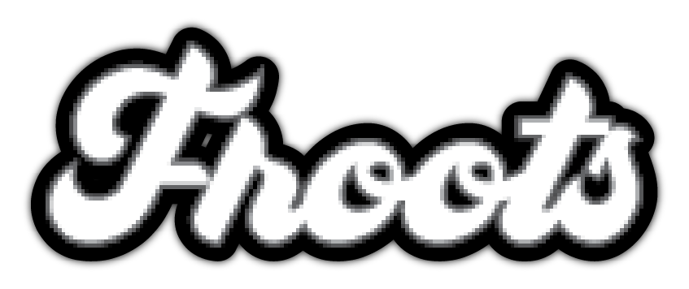
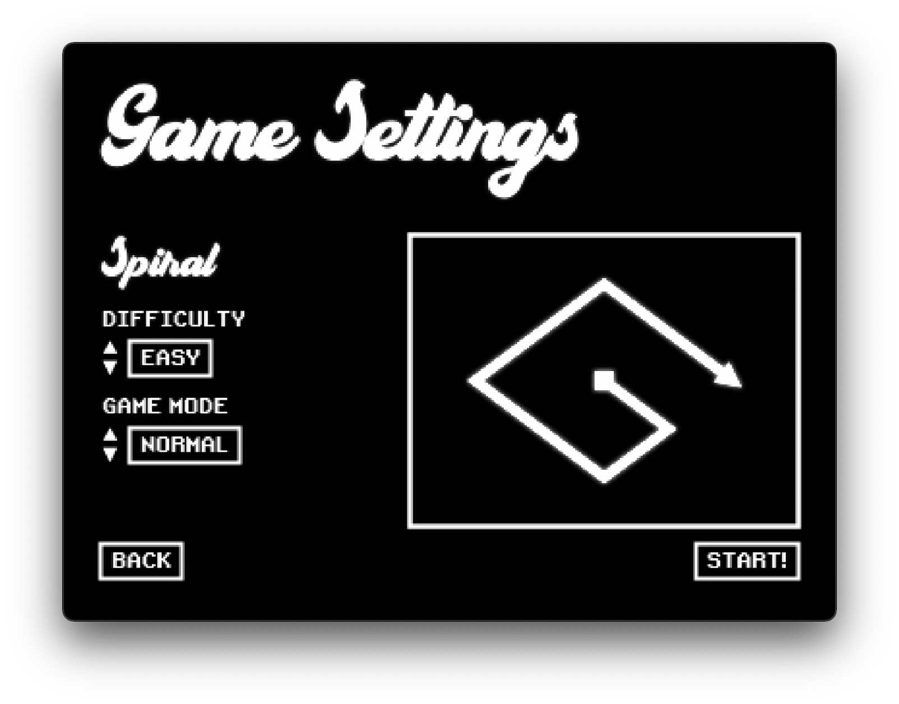
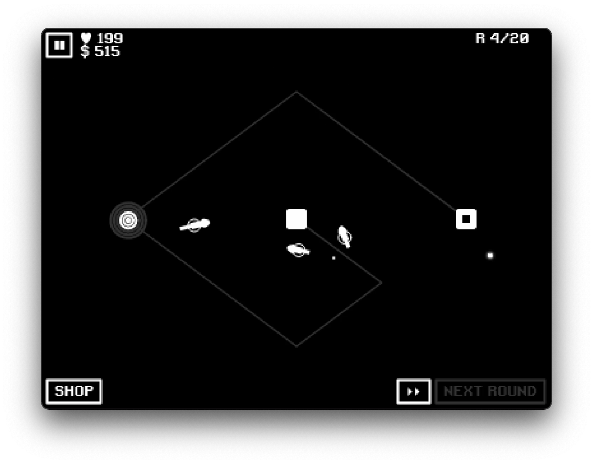
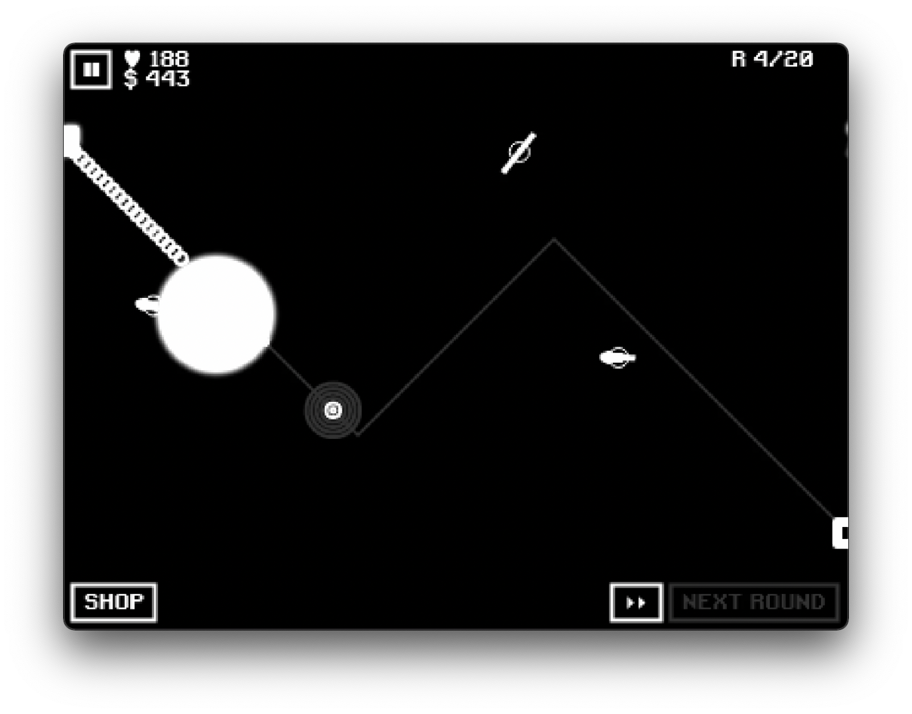
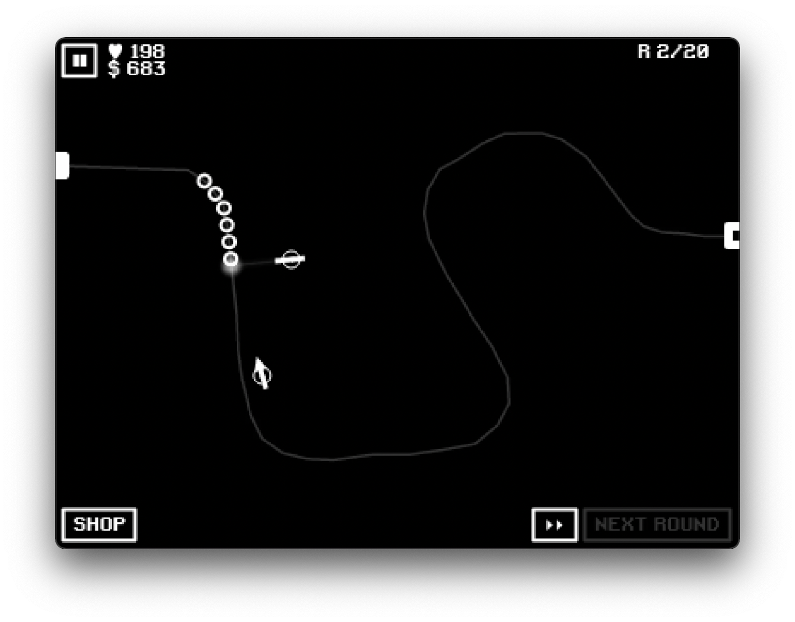

[](https://github.com/ewei2406/Froots/deployments/activity_log?environment=github-pages)

# Froots Tower Defense

A Retro-themed tower defense game!

<h1 align="center">
    <a href="https://ewei2406.github.io/Froots/"></a>
</h1>

# Features

- Retro-themed post-FX
- 16-bit sounds
- 8 unique towers
- 6 tracks of varied difficulties
- 3 game difficulties
- 3 game modes
- Bosses
- Fast-forward

<p>
  
  
  
  
</p>


# About
This project was inspired by Bloons Tower Defense, a game I loved as a child (and still do!). Some key takeaways for me were learning how to set up Typescript and some game development strategies.

# Tech stack

<p>
    
    
    
    
</p>


| Frontend |
|---       |
| Typescript    |

| Backend |
|---       |
| Node.js    |
| Express    |

| DevOps |
|---       |
| Github-Pages    |

# Local Development

## Setting up the backend

Requirements: `node`, `npm`

Clone the repository and install npm packages:
```
npm install
```
Start the app:
```
node index.js 
```
OR start the app with incremental Typescript compilation:
```
npm start
```

Visit `https://localhost:3001/`

Done!

*Interesting note: The development is a Node server designed to mimic the behavior of GitHub pages.*
